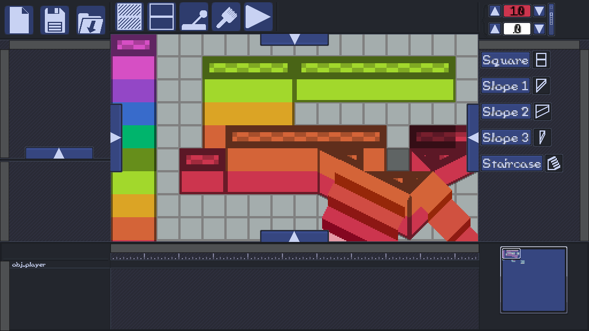
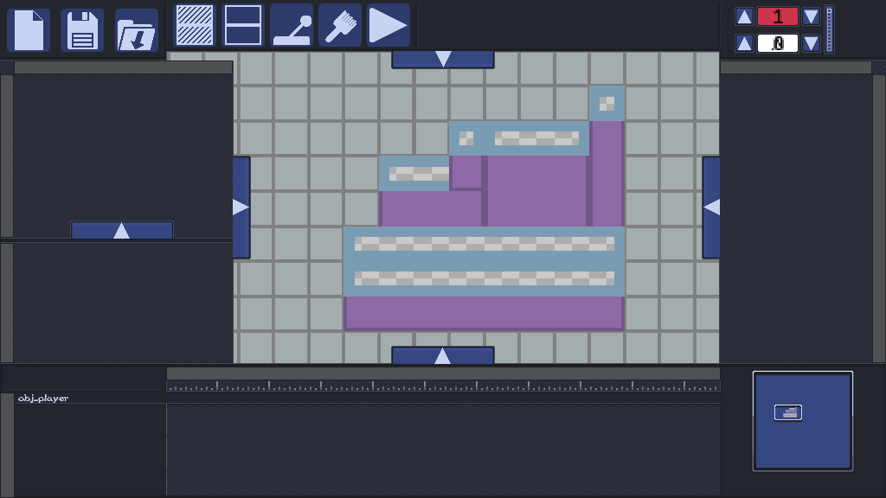
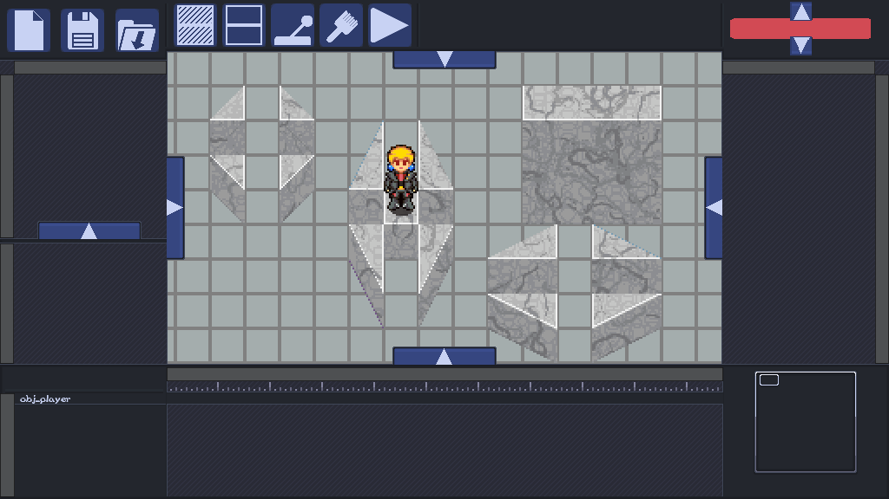
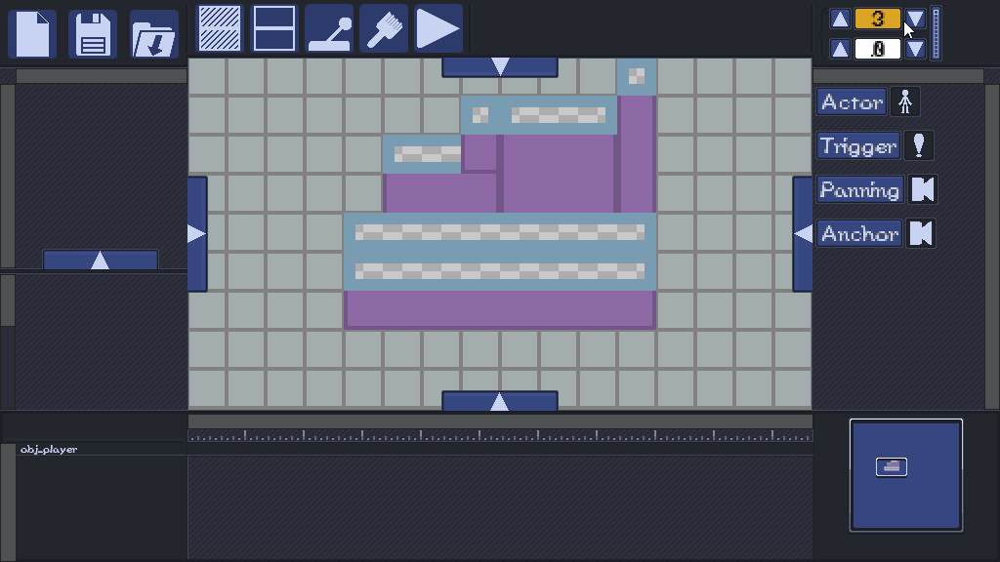
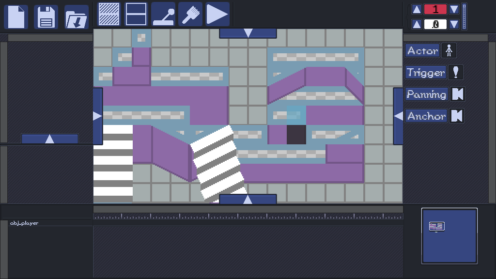
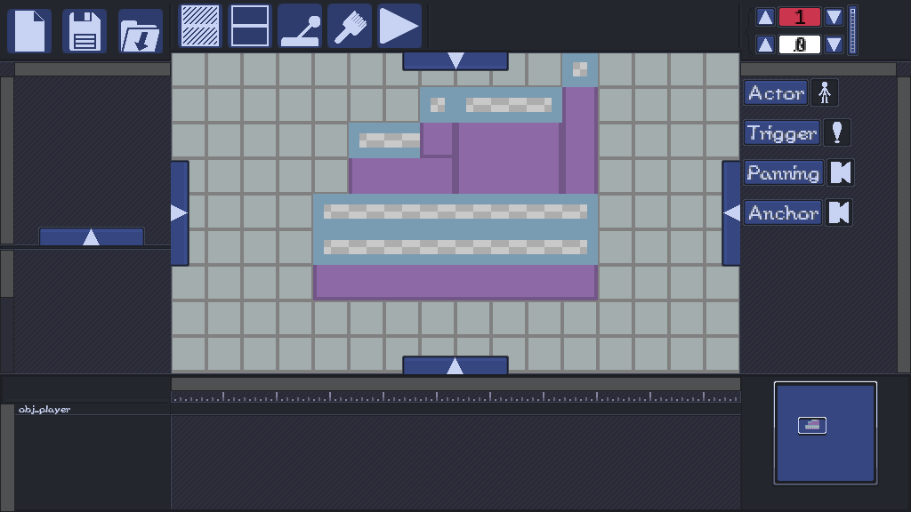
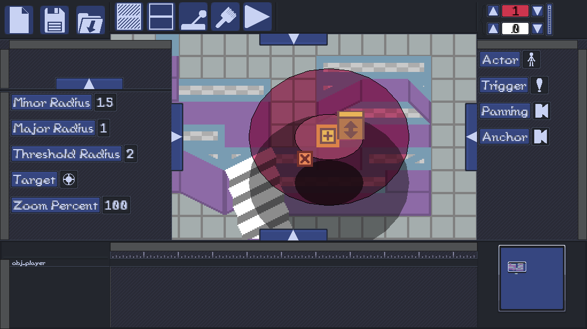
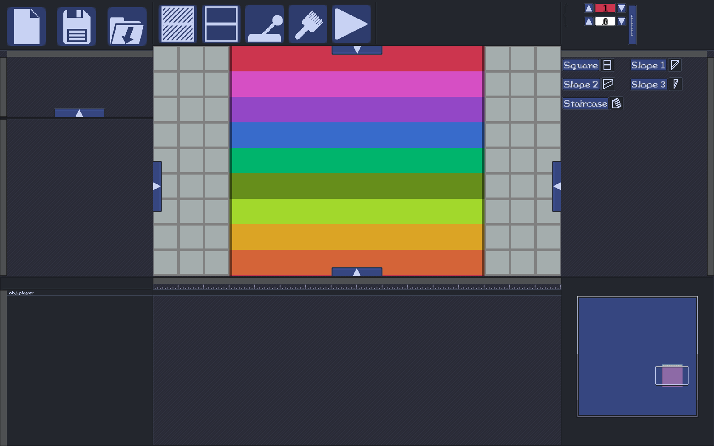
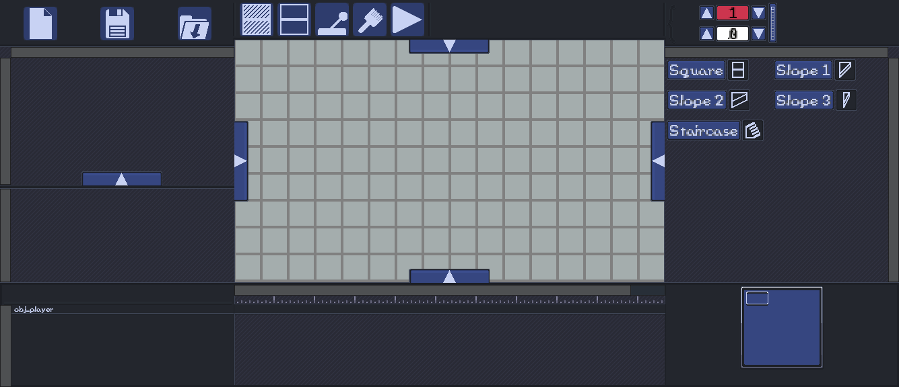

# Superstar Game Suite

The _Superstar Game Suite_ is an extensive resource library and world editor for the creation of 2D top-down platformers, particularly those with a narrative or aesthetic emphasis, within Game Maker Studio 2.

Having taken inspiration from the _Mario & Luigi_ series of JRPGs, this utility provides tools for top-down collision editing, narrative event directing, cinematography directing, dialogue scripting, multi-layer additive and subtractive tile editing, and more yet to come.

There are several procedurally generated graphics systems implemented, which should increase the potential users have for creating unique worlds intuitively.

Worlds may be saved and loaded to or from lightweight external files.

There is currently no release candidate, as the project is not yet stable, and is lacking several essential features. Regarding how you may contribute, please refer to the [CONTRIBUTING.md](CONTRIBUTING.md) document. Any collaboration would be greatly appreciated!

# Pretty Pictures
**Collision Editing**

There are a variety of available tools to enable the creation of complex multi-tiered worlds.

**Collision Editing**

When collision is built, you may test-run your creation with Minerva. Traverse across staircases, hop or fly across gaps, and fall over ledges.

**Multi-Layer Tile Editing**

This tool is in need of much polish, currently, however it is basically capable of layering tiles on top of each other, additively or subtractively, from any tileset found within the source code. Currently, loading of external tileset assets at run-time is not supported. Procedural generation of a marble texture is also implemented, however it is in an unstable state currently. In an outdated build, it appeared like so:

**Narrative Event Directing**

There are many tools provided for creating narrative events. These could be generally referred to as cutscenes, however they do not necessarily lock control of Minerva, so that term may not be accurate. A multi-tiered timeline is available for placing and moving actions in any order. Each tier corresponds to a unique actor placed in the world, which include Minerva and any NPCs.

Dialogue scripting is also implemented, but it is currently incomplete and does not playback properly when triggered at run-time.

**Cinematography Directing**

This tool provides two widgets for cinematography control outside of cutscenes. N-gon regions can be created, with edges extruded to create paths. When Minerva crosses these paths, the camera pans in a set direction proportionally to the distance yet traversed at that tick. Zooming inwards or outwards is optionally supported as well.

The other widget allows the editing an elliptical regions which pan towards an arbitrary co-ordinate in the world as Minerva approaches a threshold within its major and minor radii. This is currently unstable, however.

**Window Scaling**

This editing interface scales to any resolution, including 4K. This screencap is fullscreen in 1080p on a 16:10 monitor, but when windowed, its boundaries may be dragged however one finds convenient, and the interface will attempt to adapt elegantly.

## License

This project is licensed under the MIT License - see the [LICENSE.md](LICENSE.md) file for details
